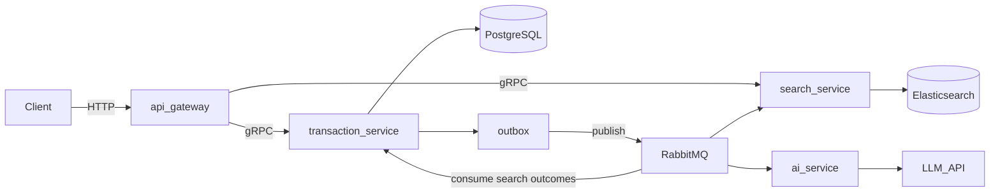

# microAgent

NestJS monorepo that models **multi-step transaction workflows**: a synchronous HTTP API and internal **gRPC**, with **PostgreSQL** as the source of truth, **RabbitMQ** for async fan-out, **Elasticsearch** for search, and an **AI worker** for enrichment off the hot path.

## Why this architecture

- **API gateway (HTTP + Swagger)** exposes a stable public API; **gRPC** keeps internal calls fast and typed.
- **PostgreSQL + Prisma** hold authoritative transaction state.
- A **transactional outbox** ties DB commits to message publishing so you do not publish events that were never persisted (or skip publishing after a successful write).
- **RabbitMQ** fans out domain events to **search-service** (indexing) and **ai-service** (LLM enrichment) without blocking the create path; **transaction-service** also **consumes** messages (e.g. search index outcomes) to update authoritative state.
- **Elasticsearch** is a **derived** search index, not the system of record.
- **AI** runs as an async consumer with configurable timeouts, retries, and validated environment (see `ai-service`).

## Flow (high level)



## Repository layout

```
apps/api-gateway          # HTTP API, Swagger; gRPC to transaction + search
apps/transaction-service  # Prisma, gRPC server, outbox, RabbitMQ publish + consume
apps/search-service       # Elasticsearch indexing, gRPC, RabbitMQ consumer
apps/ai-service           # RabbitMQ consumer, LLM client
libs/common               # Shared types, events, proto, config
infra/docker              # Docker Compose (Postgres, RabbitMQ, ES, Kibana, pgAdmin)
```

## Tech stack

- **Runtime:** Node.js, TypeScript, NestJS
- **Data:** PostgreSQL, Prisma, Elasticsearch
- **Messaging:** RabbitMQ (`amqplib`)
- **RPC:** gRPC (`@nestjs/microservices`, `@grpc/grpc-js`, `@grpc/proto-loader`)
- **API docs:** Swagger (gateway)
- **Config:** `@nestjs/config`, Joi (e.g. `ai-service`)
- **Local infra:** Docker Compose (`infra/docker/docker-compose.yml`)

## Prerequisites

- Node.js and Yarn
- Docker (for Postgres, RabbitMQ, Elasticsearch, and optional UIs)

## Quick start

1. **Install dependencies** (Yarn workspaces at repo root):

   ```bash
   yarn install
   ```

2. **Start infrastructure:**

   ```bash
   yarn infra:up
   ```

3. **Environment files** — copy each example and adjust if needed:

   - `apps/api-gateway/.env.example` → `apps/api-gateway/.env`
   - `apps/transaction-service/.env.example` → `apps/transaction-service/.env`
   - `apps/search-service/.env.example` → `apps/search-service/.env`
   - `apps/ai-service/.env.example` → `apps/ai-service/.env`

   Set `OPENROUTER_API_KEY` in `ai-service` before running the AI worker.

4. **Run services** (recommended order — each needs RabbitMQ/Postgres/ES where applicable):

   ```bash
   yarn start:dev:transaction-service
   yarn start:dev:search-service
   yarn start:dev:ai-service
   yarn start:dev:api-gateway
   ```

5. **HTTP API docs** — with default gateway `PORT=3000`:

   [http://localhost:3000/docs](http://localhost:3000/docs)

### Default ports (see `.env.example` files)

| Concern              | Default |
| -------------------- | ------- |
| Gateway HTTP         | `3000`  |
| Transaction gRPC     | `50051` |
| Search gRPC          | `50052` |
| Search HTTP (health) | `3003`  |
| AI service HTTP      | `3004`  |
| Postgres             | `5432`  |
| RabbitMQ AMQP        | `5672`  |
| RabbitMQ UI          | `15672` |
| Elasticsearch        | `9200`  |

## Useful commands

| Command           | Purpose                      |
| ----------------- | ---------------------------- |
| `yarn infra:up`   | Start Docker services        |
| `yarn infra:down` | Stop Docker services         |
| `yarn test`       | Run Jest (root config)       |
| `yarn build:*`    | Build a single app from root |

## Security

Do not commit `.env` files or API keys. The AI integration expects a provider key via environment variables only.

## Transaction creation (JSON examples)

Create a transaction with **`POST /transactions`** on the API gateway (for example `http://localhost:3000/transactions`). The body is JSON with `title`, `description`, `propertyAddress`, `price`, `buyerId`, and `sellerId`.

A successful **201** only means the record was accepted by the gateway and transaction service. **AI moderation runs asynchronously** in `ai-service`: the model decides `moderation.status` (`ALLOW`, `REJECT`, or `REVIEW`) using the rules in [`apps/ai-service/src/modules/ai/ai-client.service.ts`](apps/ai-service/src/modules/ai/ai-client.service.ts) (policy and safety first, then whether the text is a genuine property listing). On **`REJECT`**, the pipeline publishes `ai.rejected` and the transaction can end up in **`REJECTED_MODERATION`** with a **`moderationReason`** derived from the model. Exact outcomes are **LLM-dependent**; the examples below are realistic inputs aimed at each path.

The easiest way to try these payloads is **Swagger UI**: open [http://localhost:3000/docs](http://localhost:3000/docs) (same default port as in [Quick start](#quick-start)), expand **transactions** → **POST /transactions**, click **Try it out**, paste a JSON body, **Execute**, then poll **GET /transactions/{transactionId}** with the returned id.

### Observing AI results

After create, call **`GET /transactions/{transactionId}`** and inspect:

- **`state`** — e.g. `READY` when enrichment completed with `ALLOW`, or `REJECTED_MODERATION` after an AI reject path.
- **`moderationStatus`** — `PENDING` until processed, then `ALLOW`, `REJECT`, or `REVIEW`.
- **`moderationReason`** — snake_case reason from the model (e.g. `wrong_category_goods`, `policy_adult_services`).
- **`aiStatus`** — `COMPLETED` or `FAILED` depending on how far processing got.

### Example — genuine property deal (typical path: ALLOW)

```json
{
  "title": "Residential resale — 1842 River Oaks Blvd, Unit 9B (cash + conventional financing)",
  "description": "Purchase contract dated 2026-02-14 for a 1,248 sq ft corner unit in the River Oaks Residences tower. Third floor, two assigned parking spaces (P3-18, P3-19), separate storage cage S-204. HOA fee currently $612/mo; special assessment for façade work fully paid as of January 2026 per seller disclosure. Buyer financing: 30-year conventional, 20% down, lender pre-approval letter on file (First Capital Mortgage, ref FC-2026-8841). Inspection contingency satisfied 2026-02-28; appraisal came in at contract price. Target closing 2026-03-28 at Chicago Title — downtown branch. Personal property excluded except washer, dryer, and mounted smart thermostat as listed in addendum C.",
  "propertyAddress": "1842 River Oaks Boulevard, Unit 9B, Houston, TX 77019, USA",
  "price": 487500,
  "buyerId": "crm-contact-maria-santos-7f3c9a21-4410-4e2b-9c6d-88aa1100beef",
  "sellerId": "crm-account-river-oaks-holdings-llc-0192aa77-6b3d-4f1e-a8c0-221144eedd00"
}
```

### Example — electronics / goods (aimed at AI REJECT: not a property listing)

```json
{
  "title": "Apple MacBook Pro 16\" M3 Max — 36GB RAM, 1TB SSD, AppleCare+ through 2027",
  "description": "Selling my work laptop after switching employers. Purchased October 2025 from Apple Store Domain; receipt and original box included. Battery cycle count 42, no repairs. Minor scuff on lid corner (see photos in shared folder). Includes 140W USB-C adapter. Cash or Zelle only; can meet buyer at Starbucks on Lamar during lunch hours this week. Not interested in trades. Serial on file with buyer protection checklist.",
  "propertyAddress": "Meetup: Starbucks, 11029 Domain Dr, Austin, TX 78758",
  "price": 2899,
  "buyerId": "marketplace-user-alex-rivera-20260211",
  "sellerId": "marketplace-user-jordan-kim-20250930"
}
```

### Example — vehicle (aimed at AI REJECT: wrong category)

```json
{
  "title": "2019 Ford F-150 Lariat SuperCrew 4x4 — 5.0L, tow package, one owner",
  "description": "Garage-kept truck, 58,400 miles, all service at dealer through 2025. New tires Dec 2025; brake fluid flushed per maintenance minder. Spray-in bed liner, factory running boards, integrated trailer brake controller. Clean title in hand; lien released 2024. Carfax available. Selling because we downsized to a sedan. Serious buyers only; test drives with proof of insurance. Third row not applicable — crew cab with full rear doors.",
  "propertyAddress": "Seller residence: 4421 Mesa Verde Cir, Fort Collins, CO 80526 (showing by appointment)",
  "price": 36900,
  "buyerId": "crm-lead-truck-buyer-noco-88421",
  "sellerId": "crm-contact-seller-f150-oneowner"
}
```

### Example — adult-oriented service masquerading as “suite rental” (aimed at AI REJECT: policy)

```json
{
  "title": "Discreet downtown “executive suite” — staffed appointments, flexible hours, turnkey",
  "description": "Upscale incall location near convention district. Packages by the hour; experienced attendants; membership optional. Discretion assured; billing descriptor neutral. Not a traditional lease—operator handles scheduling and intake. Ideal for traveling professionals seeking privacy. References on request for verified clients only. No walk-ins; text the booking line with availability window.",
  "propertyAddress": "Downtown loft district — exact suite # disclosed after screening, Dallas, TX 75201",
  "price": 250,
  "buyerId": "crm-placeholder-buyer-opaque-01",
  "sellerId": "crm-placeholder-seller-opaque-01"
}
```

## License

`UNLICENSED` — see [package.json](package.json). All rights reserved unless you add an explicit license.
