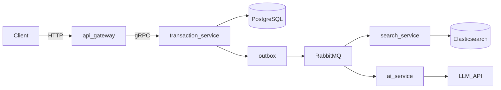

# microAgent

NestJS monorepo that models **multi-step transaction workflows**: a synchronous HTTP API and internal **gRPC**, with **PostgreSQL** as the source of truth, **RabbitMQ** for async fan-out, **Elasticsearch** for search, and an **AI worker** for enrichment off the hot path.

## Why this architecture

- **API gateway (HTTP + Swagger)** exposes a stable public API; **gRPC** keeps internal calls fast and typed.
- **PostgreSQL + Prisma** hold authoritative transaction state.
- A **transactional outbox** ties DB commits to message publishing so you do not publish events that were never persisted (or skip publishing after a successful write).
- **RabbitMQ** fans out domain events to **search-service** (indexing) and **ai-service** (LLM enrichment) without blocking the create path.
- **Elasticsearch** is a **derived** search index, not the system of record.
- **AI** runs as an async consumer with configurable timeouts, retries, and validated environment (see `ai-service`).

## Flow (high level)



## Repository layout

```
apps/api-gateway          # HTTP API, Swagger, gRPC clients
apps/transaction-service  # Prisma, gRPC server, outbox, RabbitMQ publish
apps/search-service       # Elasticsearch indexing, gRPC, RabbitMQ consumer
apps/ai-service           # RabbitMQ consumer, LLM client
libs/common               # Shared types, events, proto, config
infra/docker              # Docker Compose (Postgres, RabbitMQ, ES, Kibana, pgAdmin)
```

## Tech stack

- **Runtime:** Node.js, TypeScript, NestJS
- **Data:** PostgreSQL, Prisma, Elasticsearch
- **Messaging:** RabbitMQ (`amqplib`)
- **RPC:** gRPC (`@nestjs/microservices`, `@grpc/grpc-js`, `@grpc/proto-loader`)
- **API docs:** Swagger (gateway)
- **Config:** `@nestjs/config`, Joi (e.g. `ai-service`)
- **Local infra:** Docker Compose (`infra/docker/docker-compose.yml`)

## Prerequisites

- Node.js and Yarn
- Docker (for Postgres, RabbitMQ, Elasticsearch, and optional UIs)

## Quick start

1. **Install dependencies** (Yarn workspaces at repo root):

   ```bash
   yarn install
   ```

2. **Start infrastructure:**

   ```bash
   yarn infra:up
   ```

3. **Environment files** — copy each example and adjust if needed:

   - `apps/api-gateway/.env.example` → `apps/api-gateway/.env`
   - `apps/transaction-service/.env.example` → `apps/transaction-service/.env`
   - `apps/search-service/.env.example` → `apps/search-service/.env`
   - `apps/ai-service/.env.example` → `apps/ai-service/.env`

   Set `OPENROUTER_API_KEY` in `ai-service` before running the AI worker.

4. **Database schema** (from repo root):

   ```bash
   yarn --cwd apps/transaction-service prisma:generate
   yarn --cwd apps/transaction-service prisma:migrate:dev
   ```

5. **Run services** (recommended order — each needs RabbitMQ/Postgres/ES where applicable):

   ```bash
   yarn start:dev:transaction-service
   yarn start:dev:search-service
   yarn start:dev:ai-service
   yarn start:dev:api-gateway
   ```

6. **HTTP API docs** — with default gateway `PORT=3000`:

   [http://localhost:3000/docs](http://localhost:3000/docs)

### Default ports (see `.env.example` files)

| Concern              | Default |
| -------------------- | ------- |
| Gateway HTTP         | `3000`  |
| Transaction gRPC     | `50051` |
| Search gRPC          | `50052` |
| Search HTTP (health) | `3003`  |
| AI service HTTP      | `3004`  |
| Postgres             | `5432`  |
| RabbitMQ AMQP        | `5672`  |
| RabbitMQ UI          | `15672` |
| Elasticsearch        | `9200`  |

## Useful commands

| Command           | Purpose                      |
| ----------------- | ---------------------------- |
| `yarn infra:up`   | Start Docker services        |
| `yarn infra:down` | Stop Docker services         |
| `yarn test`       | Run Jest (root config)       |
| `yarn build:*`    | Build a single app from root |

## Security

Do not commit `.env` files or API keys. The AI integration expects a provider key via environment variables only.

## License

`UNLICENSED` — see [package.json](package.json). All rights reserved unless you add an explicit license.
